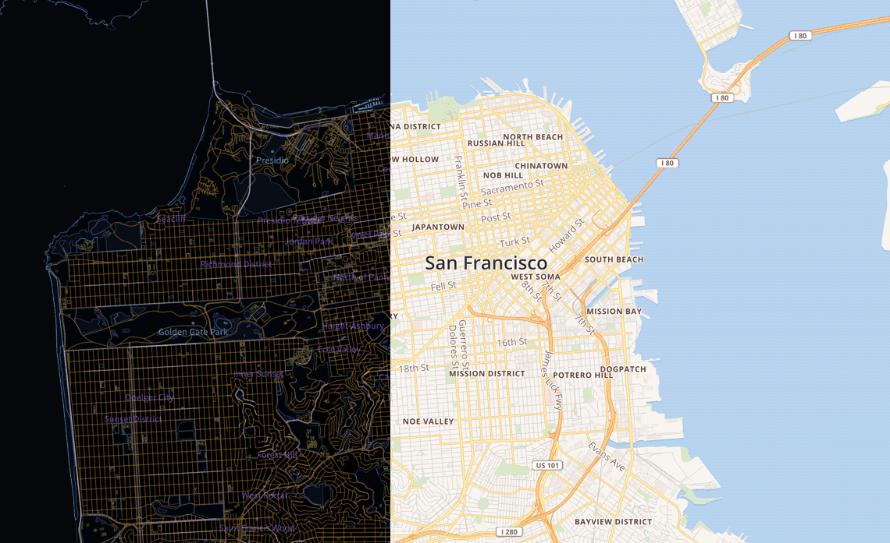

# Mapbox Studio Classic Manual

## Overview

[Mapbox Studio Classic](https://www.mapbox.com/help/define-mapbox-studio-classic) is a legacy desktop application for building custom maps. This manual contains information on how Mapbox Studio Classic works, some guidance on best practices, and a comprehensive application reference.

## Using this manual

This manual contains a comprehensive explanation of Mapbox Studio Classic, including narrative descriptions of how to use different parts of the tool and tutorials with guided walk throughs of specific projects.

- **Manual** &mdash; The Manual section is the reference portion of this document. It contains both technical descriptions of the Mapbox Studio Classic interface as well as conceptual explanations of the map components you're working with.
- **Tutorials** &mdash; The [Tutorials folder](../tutorials/) contains several step-by-step guides for creating custom projects in Mapbox Studio Classic.

## What is Mapbox Studio Classic?

[Mapbox Studio Classic](https://github.com/mapbox/mapbox-studio-classic) is a desktop application for designing beautiful maps *and* converting custom data into compact [vector tiles](https://www.mapbox.com/developers/vector-tiles) &mdash; a fast map tile specification. Map data is hosted remotely as vector data, completely separate from the map style, which means smaller uploads, multiple style variations on the same data, and faster design iterations.

### How does it work?

Digital maps are made up of three major parts &mdash; geospatial data, styling rules describing how the data should look, and a tool that takes those and displays a map. In the case of Mapbox Studio Classic, geospatial data are formatted as [tilesets](https://www.mapbox.com/help/define-tileset), style rules are written as [CartoCSS](https://www.mapbox.com/help/define-cartocss), and the map is rendered by [Mapnik](http://mapnik.org/).

*Shown left:* source mode, *shown right:* style mode.

In *source* and *style* modes within Mapbox Studio Classic, you can accomplish two of these three major tasks:

- Create vector tiles using custom data you provide **(source)**.
- Design maps with CartoCSS using Mapbox or custom data sources **(style)**.

Mapbox Studio Classic doesn't render your map itself; it provides the tools to create your sources and styles which, once uploaded to your Mapbox account, can be rendered by Mapnik.

## Getting started

Before moving forward, make sure to [**download and install Mapbox Studio Classic**](https://github.com/mapbox/mapbox-studio-classic) so you'll be able to follow along with the Manual and Tutorials.
