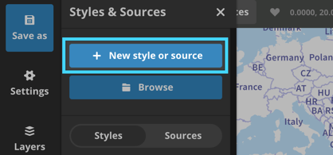
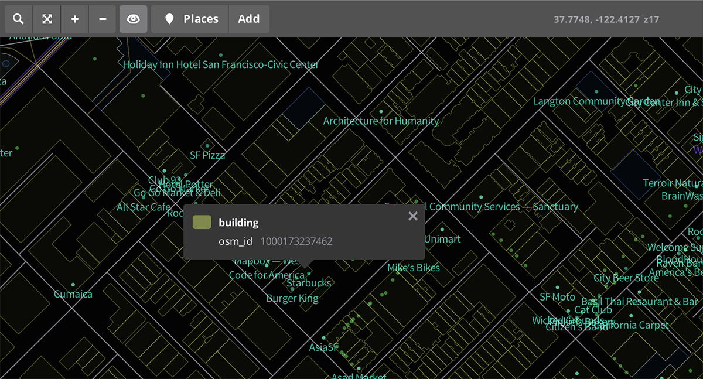
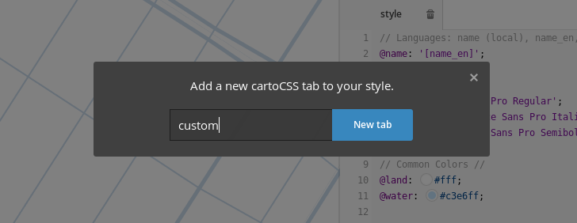
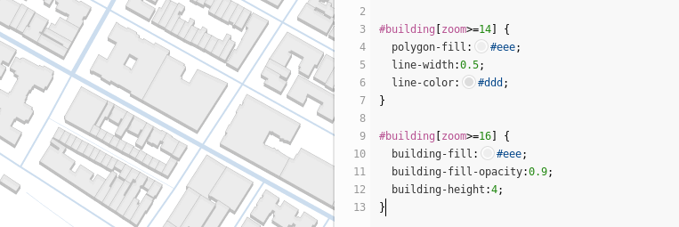
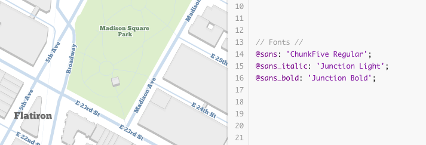
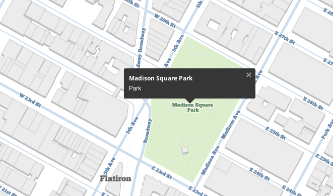

# Mapbox Studio Classic style quickstart

Mapbox Studio Classic uses a language called CartoCSS to determine the look of a map. You can manipulate the map's colors, sizes, and shapes by applying specific CartoCSS rules. Read the [CartoCSS section](https://www.mapbox.com/help/studio-classic-cartocss/) of the Mapbox Studio Classic manual for a more detailed introduction to the language.

In this guide, you'll take the Mapbox Basic style and add buildings, roads, and parks by writing CartoCSS. You'll also make the map style interactive by adding tooltips to the POI (points of interest) layer.

## Getting started

Here are a few resources you'll need before getting started:

- **Mapbox account**. Sign up for free at [mapbox.com/studio/sign-up](https://www.mapbox.com/studio/signup/). You will be uploading your map style to your Mapbox account at the end of this tutorial.
- **Mapbox Studio Classic**. If you haven't already, make sure to [**download and install Mapbox Studio Classic**](https://github.com/mapbox/mapbox-studio-classic).

## Create a style project

Create a new style by clicking on __Styles &amp; Sources__ in the lower left, and click __New style or source__. Select the __Basic__ style. The Basic style includes basic styling for for roads, city names, admin borders, rivers, and more.



## Inspect the vector source

Center the map preview around New York City and zoom in to zoom level 17 (z17). Click the inspect icon on the map preview pane. Although the map currently looks empty, there are many features available for styling in this area.

Mapbox Studio Classic includes a vector source inspector that will show you all layers and features for the vector source. Like the DOM inspector in web browsers, the vector source inspector shows you details about the fields and features in vector tiles that can be styled. Click a building polygon on the map to see its properties.



By inspecting the map, you can see that buildings are stored in the `building` layer. You'll use `building` as the selector to style the buildings with CartoCSS.

Toggle the inspect icon again to return to the normal map preview.

## Add a stylesheet tab

Add a new CartoCSS tab to hold your new styles. Click on the plus button on the top right of the style editor to add a new tab. Name your tab "custom".



## Style buildings

Right now the map doesn't show any buildings because they haven't been styled. Next, you'll style the buildings to add them to the map. Add the following CartoCSS to your "custom" stylesheet and then click __Save__.

```scss
#building[zoom>=14] {
  polygon-fill: #eee;
  line-width: 0.5;
  line-color: #ddd;
}
```

The code above does the following:

- `#building` selects the building layer as the one that will be styled.
- `[zoom>=14]` restricts the styles to zoom level 14 or greater.
- `polygon-fill: #eee` fills the building polygons with a light grey color.

The map should now include light gray buildings.


To add depth to your buildings at higher zoom levels, add another set of rules that use the `building` selector to render polygons as block-like shapes. Add the following CartoCSS to your "custom" stylesheet right after the code you added above. Click __Save__ to save and see your changes.

```scss
#building[zoom>=16] {
  building-fill: #eee;
  building-fill-opacity: 0.9;
  building-height: 4;
}
```

At higher zoom levels buildings should now include a shadow effect that gives the appearance of depth.



## Style parks

Next, add parks to the map by styling them. Add the following CartoCSS to your "custom" stylesheet and then click __Save__.

```scss
#landuse[class='park'] {
  polygon-fill: #dec;
}

#poi_label[maki='park'][scalerank<=3][zoom>=15] {
  text-name: @name;
  text-face-name: @sans;
  text-size: 10;
  text-wrap-width: 60;
  text-fill: #686;
  text-halo-fill: #fff;
  text-halo-radius: 1;
  text-halo-rasterizer: fast;
}
```

The code above does the following:

- `#landuse` selects features from the landuse layer.
- `[class='park']` restricts the landuse layer to features where the `class` attribute is `park`.
- `#poi_label` selects the poi_label layer for labeling parks.
- `[maki='park'][scalerank<=3][zoom>=15]` restricts the poi_label layer to prominent park labels and restricts their visibility to zoom level 15 or greater.
- `text-name: @name` sets the field that label contents will use for their text. It references the existing `@name` variable defined in the `style` tab.
- `text-face-name: @sans` sets the font to use for displaying labels. It references the existing `@sans` variable defined in the `style` tab.
- `text-wrap-width: 60` sets a maximum width for a single line of text.
- `text-halo-rasterizer: fast` uses an alternative optimized algorithm for drawing halos around text that improves rendering speed.

The map should now include light green parks with labels.


## Label roads

Finally, add road labels by adding the following CartoCSS to your "custom" stylesheet and clicking __Save__.

```scss
#road_label[zoom>=13] {
  text-name: @name;
  text-face-name: @sans;
  text-size: 10;
  text-placement: line;
  text-avoid-edges: true;
  text-fill: #68a;
  text-halo-fill: #fff;
  text-halo-radius: 1;
  text-halo-rasterizer: fast;
}
```

The code above does the following:

- `#road_label` selects features from the road_label layer.
- `[zoom>=13]` restricts the road_label layer to zoom level 13 or greater.
- `text-placement: line` sets labels to follow the orientation of lines rather than horizontally.
- `text-avoid-edges: true` forces labels to be placed away from tile edges to avoid being clipped.

The map should now include road labels.


## Add custom fonts

Mapbox Studio Classic comes with several fonts you can use out of the box. You can see the full list by clicking **Fonts** in the bar on the left side of the interface. You can also add a custom font. Next, you'll download and add a custom font to your style.

### Download custom fonts

Download fonts [Junction](https://www.theleagueofmoveabletype.com/junction) and [Chunk](https://www.theleagueofmoveabletype.com/chunk) from open-source type collective, [League of Moveable Type](https://github.com/theleagueof). Next, open your style's `.tm2` folder and create a new *fonts* folder. Copy the `.otf` files from both fonts into the new folder.


_.woff, .ttf, and .otf are all acceptable font formats in Mapbox Studio Classic, however only use one format to reduce file size of your map on upload._

### Add custom fonts to your style

Before you can use the fonts, you must set the font directory reference. In the "style" CartoCSS tab, search for the `Map` element and add `font-directory: url("fonts/");`. Click **Save**. Your code should look like this:

```scss
Map {
  background-color: @land;
  font-directory: url("fonts/");
}
```

Open the **Fonts** tab and you will now see your custom fonts listed. You can use your fonts by name anywhere in your style and they will be packaged with the style when uploaded to Mapbox or exported as a `.tm2z`.


Change the font variables in the "style" CartoCSS tab from `Source Sans Pro` to `ChunkFive Regular`, `Junction Light`, and `Junction Bold`.

```scss
// Fonts
@sans: 'ChunkFive Regular';
@sans_italic: 'Junction Light';
@sans_bold: 'Junction Bold';
```

**Save** and admire your new font!



## Add UTFGrid interactivity

You can also add interactivity to the POI labels on the map. First, quit and close Mapbox Studio Classic. From your `.tm2` folder, open the `project.yml` file in a text editor. Remove the single quotes (`' '`) to the right of `interactivity_layer` and replace like so:

```yaml
interactivity_layer: poi_label
```

Now remove the single quotes (`' '`) to the right of `template` field and replace with the following [HTML/Mustache template](https://github.com/mapbox/utfgrid-spec/blob/master/1.3/interaction.md#template) code:

```yaml
template: |-
  <strong>{{name}}</strong>
  {{#type}}
  <br /><small>{{type}}</small>
  {{/type}}
  {{#address}}
  <br /><small>{{address}}</small>
  {{/address}}
  {{#website}}
  <br /><small><a href='{{website}}'>Website</a></small>
  {{/website}}
```

The code above is doing the following:

- `<strong>{{name}}</strong>` adds the name of the POI in bold text.
- `{{#type}}<br /><small>{{type}}</small>{{/type}}` adds the type of POI in small text if it exists.
- `{{#address}}<br /><small>{{address}}</small>{{/address}}` adds the address of the POI in small text if it exists.
- `{{#website}}<br /><small><a href='{{website}}'>Website</a></small>{{/website}}` adds the website of the POI in small text with a link to the website if it exists.

Restart Studio and hover over a park location to see your layer in action.



_After making edits to the `project.yml` file in a text editor you should quit and restart Mapbox Studio Classic to see your changes. Mapbox Studio Classic loads up your project into memory and currently does not detect changes from other text editors._


## Upload

To upload your project open the **Settings** panel and then click **Upload to Mapbox**.


## Mission complete

Your map style is now deployed Mapbox on your [Classic](https://www.mapbox.com/studio/classic/) page and has a __map ID__. You can use this map with any of the [Mapbox developer APIs](https://www.mapbox.com/developers) to integrate into your apps and sites.

## Next steps

Want to build more with Mapbox Studio Classic? Check out the [Mapbox Studio Classic source quickstart](https://www.mapbox.com/help/source-quickstart/).
